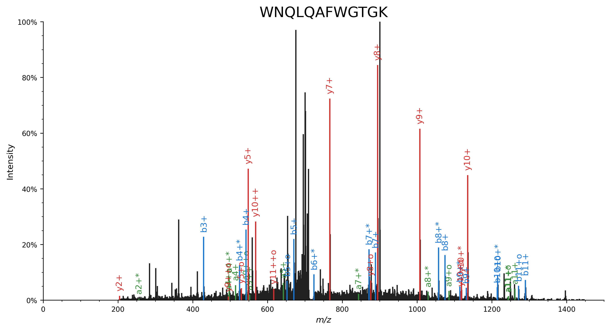
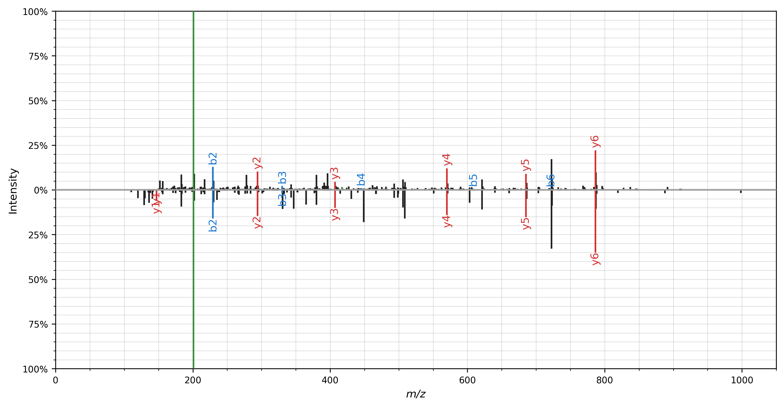

# Spectrum visualization

The [quickstart](quickstart.md) briefly introduced the spectrum_utils plotting functionality.
Often, nice spectrum graphics can be created with only a single line of code; it's as easy as using `spectrum_utils.plot.spectrum(...)` to visualize a single spectrum.

Here we will briefly describe some advanced functionality to customize your spectrum plots.
Some of the arguments that can be provided to `spectrum_utils.plot.spectrum(...)` are:

- `color_ions`: Boolean flag indicating whether the peaks should be colored.
- `annot_fmt`: A function that converts a `FragmentAnnotation` to a label to annotate the corresponding peak (see below).
- `annot_kws`: A dictionary with options to customize textual peak annotations.
See the [`matplotlib.text.Text` documentation](https://matplotlib.org/3.1.1/api/text_api.html#matplotlib.text.Text) for available options.
- `grid`: Enable/disable the grid.

See the [API reference](api.md) for full details on how to use these settings.

## Peak annotations

By default, singly-charged b and y peptide fragment ions are annotated with a label in the spectrum plots.
To avoid overcrowding the spectrum plots, other peaks will be highlighted in the matching color, but will not receive an annotation label.
However, which peaks to annotate and the format of the label can be fully customized by providing a callable that implements your desired behavior to `annot_fmt`.

Here we will show example code that can guide you in implementing your custom peak labeling functionality.
As mentioned previously, the default implementation labels singly-charged b and y peptide ions that have not undergone a neutral loss (slightly adapted for conciseness):

```python
def annotate_ion_type(annotation, ion_types="by"):
    if (
        annotation.ion_type[0] in ion_types
        and annotation.neutral_loss is None
        and annotation.isotope == 0
        and annotation.charge == 1
    ):
        return annotation.ion_type
    else:
        return ""
```

To annotate additional [ion types](ion_types), you can reuse the default implementation in combination with `functools.partial`:

```python
import functools
import spectrum_utils.plot

spectrum_utils.plot.spectrum(..., annot_fmt=functools.partial(ion_types="abyIm"))
```

Peak labels that contain full information according to the [PSI peak interpretation specification](https://docs.google.com/document/d/1yEUNG4Ump6vnbMDs4iV4s3XISflmOkRAyqUuutcCG2w/edit?usp=sharing) can be achieved by using the `str` function: `spectrum_utils.plot.spectrum(..., annot_fmt=str)`.

Finally, we'll show an example of custom peak labeling functionality that indicates the charge state by repeated `+` symbols, neutral loss of ammonia by the `*` symbol, and neutral loss of water by the `o` symbol. This behavior is similar to the [Lorikeet spectrum viewer](https://uwpr.github.io/Lorikeet/).

```python
import matplotlib.pyplot as plt
import spectrum_utils.plot as sup
import spectrum_utils.spectrum as sus


def annotate_ion_type(annotation, ion_types="aby"):
    if annotation.ion_type[0] in ion_types:
        if abs(annotation.isotope) == 1:
            iso = "+i" if annotation.isotope > 0 else "-i"
        elif annotation.isotope != 0:
            iso = f"{annotation.isotope:+}i"
        else:
            iso = ""
        nl = {"-NH3": "*", "-H2O": "o"}.get(annotation.neutral_loss, "")
        return f"{annotation.ion_type}{iso}{'+' * annotation.charge}{nl}"
    else:
        return ""


usi = "mzspec:PXD014834:TCGA-AA-3518-01A-11_W_VU_20120915_A0218_3F_R_FR01:scan:8370"
peptide = "WNQLQAFWGTGK"
spectrum = sus.MsmsSpectrum.from_usi(usi)
spectrum.annotate_proforma(
    peptide,
    fragment_tol_mass=0.05,
    fragment_tol_mode="Da",
    ion_types="aby",
    max_ion_charge=2,
    neutral_losses={"NH3": -17.026549, "H2O": -18.010565},
)

fig, ax = plt.subplots(figsize=(12, 6))
sup.spectrum(spectrum, annot_fmt=annotate_ion_type, grid=False, ax=ax)
ax.set_title(peptide, fontdict={"fontsize": "xx-large"})
ax.spines["right"].set_visible(False)
ax.spines["top"].set_visible(False)
plt.savefig("annot_fmt.png", dpi=300, bbox_inches="tight")
```



## Mirror plot

A mirror plot can be used to visualize matching spectra, for example, to plot identifications from spectral library searching.
Again, only a single line of code is required to do the actual plotting: `spectrum_utils.plot.mirror(...)`

```python
import matplotlib.pyplot as plt
import spectrum_utils.plot as sup
import spectrum_utils.spectrum as sus


peptide = "DLTDYLM[Oxidation]K"
usi_top = "mzspec:MSV000079960:DY_HS_Exp7-Ad1:scan:30372"
spectrum_top = sus.MsmsSpectrum.from_usi(usi_top)
spectrum_top.annotate_proforma(peptide, 0.5, "Da", ion_types="aby")
usi_bottom = "mzspec:MSV000080679:j11962_C1orf144:scan:10671"
spectrum_bottom = sus.MsmsSpectrum.from_usi(usi_bottom)
spectrum_bottom.annotate_proforma(peptide, 0.5, "Da", ion_types="aby")

fig, ax = plt.subplots(figsize=(12, 6))
sup.mirror(spectrum_top, spectrum_bottom, ax=ax)
plt.savefig("mirror.png", dpi=300, bbox_inches="tight")
plt.close()
```



All of the advanced plotting arguments described above can be provided for the mirror plot as well using the `spectrum_kws` argument.

## Interactive plotting

Besides the standard plotting functionality in `spectrum_utils.plot`, spectrum_utils also contains interactive plotting functionality in `spectrum_utils.iplot`.
`iplot` is a drop-in replacement for `plot`; only the import statement needs to be changed to produce interactive plots.

Interactive plot of an individual spectrum:

<script src="https://cdn.jsdelivr.net/npm/vega@5"></script>
<script src="https://cdn.jsdelivr.net/npm/vega-lite@3"></script>
<script src="https://cdn.jsdelivr.net/npm/vega-embed@4"></script>

```python
import spectrum_utils.iplot as sup
import spectrum_utils.spectrum as sus


usi = "mzspec:PXD004732:01650b_BC2-TUM_first_pool_53_01_01-3xHCD-1h-R2:scan:41840"
spectrum = sus.MsmsSpectrum.from_usi(usi)
spectrum.annotate_proforma("WNQLQAFWGTGK", 10, "ppm", ion_types="aby")

chart = sup.spectrum(spectrum)
chart.properties(width=640, height=400).save("iplot_spectrum.json")
```

<div id="spectrum"></div>

Interactive mirror plot of two spectra:

```python
import spectrum_utils.iplot as sup
import spectrum_utils.spectrum as sus


peptide = "DLTDYLM[Oxidation]K"
usi_top = "mzspec:MSV000079960:DY_HS_Exp7-Ad1:scan:30372"
spectrum_top = sus.MsmsSpectrum.from_usi(usi_top)
spectrum_top.annotate_proforma(peptide, 0.5, "Da", ion_types="aby")
usi_bottom = "mzspec:MSV000080679:j11962_C1orf144:scan:10671"
spectrum_bottom = sus.MsmsSpectrum.from_usi(usi_bottom)
spectrum_bottom.annotate_proforma(peptide, 0.5, "Da", ion_types="aby")

chart = sup.mirror(spectrum_top, spectrum_bottom)
chart.properties(width=640, height=400).save("iplot_mirror.json")
```

<div id="mirror"></div>

<script type="text/javascript">
  var spectrum = "https://raw.githubusercontent.com/bittremieux/spectrum_utils/master/docs/src/iplot_spectrum.json";
  var mirror = "https://raw.githubusercontent.com/bittremieux/spectrum_utils/master/docs/src/iplot_mirror.json";
  vegaEmbed('#spectrum', spectrum).then(function(result) {
  }).catch(console.error);
  vegaEmbed('#mirror', mirror).then(function(result) {
  }).catch(console.error);
</script>

For more information on how to manipulate these interactive plots, see the [Vega-Altair documentation](https://altair-viz.github.io/index.html).

Interactive plots can be [saved](https://altair-viz.github.io/user_guide/saving_charts.html) as html files or other output formats, and can be embedded as JSON into web pages using [Vega-Embed](https://github.com/vega/vega-embed).

## Miscellaneous

### Peak colors

By default, peaks are colored based on their [ion type](ion_types) as follows:

- <svg width="10" height="10"><rect width="10" height="10" style="fill:#388E3C;stroke-width:1;stroke:rgb(0,0,0)" /></svg> a peptide fragments (`"a"`)
- <svg width="10" height="10"><rect width="10" height="10" style="fill:#1976D2;stroke-width:1;stroke:rgb(0,0,0)" /></svg> b peptide fragments (`"b"`)
- <svg width="10" height="10"><rect width="10" height="10" style="fill:#00796B;stroke-width:1;stroke:rgb(0,0,0)" /></svg> c peptide fragments (`"c"`)
- <svg width="10" height="10"><rect width="10" height="10" style="fill:#7B1FA2;stroke-width:1;stroke:rgb(0,0,0)" /></svg> x peptide fragments (`"x"`)
- <svg width="10" height="10"><rect width="10" height="10" style="fill:#D32F2F;stroke-width:1;stroke:rgb(0,0,0)" /></svg> y peptide fragments (`"y"`)
- <svg width="10" height="10"><rect width="10" height="10" style="fill:#F57C00;stroke-width:1;stroke:rgb(0,0,0)" /></svg> z peptide fragments (`"z"`)
- <svg width="10" height="10"><rect width="10" height="10" style="fill:#FBC02D;stroke-width:1;stroke:rgb(0,0,0)" /></svg> internal fragment ions (`"m"`)
- <svg width="10" height="10"><rect width="10" height="10" style="fill:#455A64;stroke-width:1;stroke:rgb(0,0,0)" /></svg> immonium ions (`"I"`)
- <svg width="10" height="10"><rect width="10" height="10" style="fill:#512DA8;stroke-width:1;stroke:rgb(0,0,0)" /></svg> intact precursor ions (`"p"`)
- <svg width="10" height="10"><rect width="10" height="10" style="fill:#212121;stroke-width:1;stroke:rgb(0,0,0)" /></svg> unknown and unannotated ions

To change these colors, overwrite values in the `spectrum_utils.plot.colors` dictionary with your preferred colors:

```python
import spectrum_utils.plot as sup


sup.colors["y"] = "#FF1493"
```
