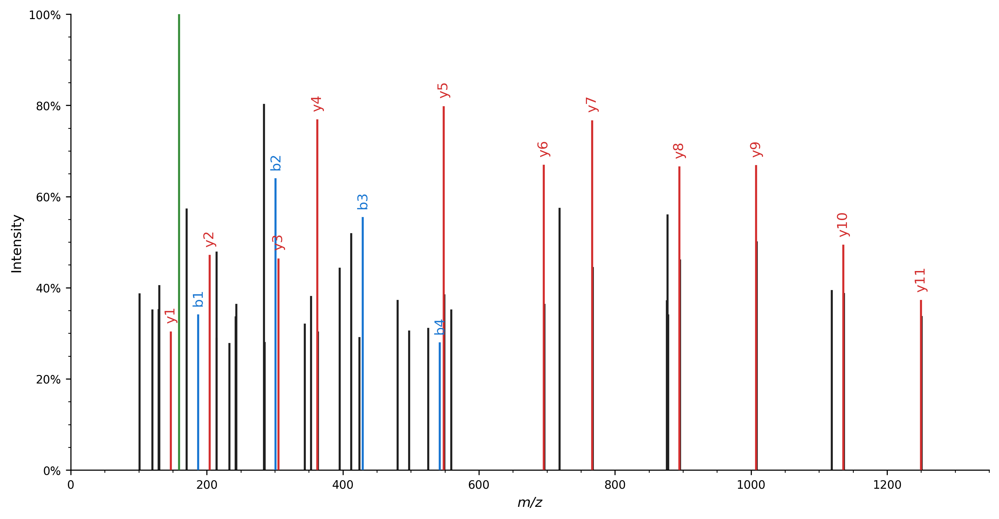

# Quickstart

Here we briefly introduce spectrum_utils' MS/MS spectrum processing and
visualization functionality:

- Restrict the mass range to 100–1400 _m_/_z_ to filter out irrelevant peaks.
- Remove the precursor peak.
- Remove low-intensity noise peaks by only retaining peaks that are at at least
5% of the base peak intensity and restrict the total number of peaks to the 50
most intense peaks.
- Scale the peak intensities by their square root to de-emphasize overly
intense peaks.
- Annotate peaks corresponding to 'b', 'y', and 'a' peptide fragments.

IO functionality is not included in spectrum_utils. Instead you can use
excellent libraries to read a variety of mass spectrometry data formats such as
[Pyteomics](https://pyteomics.readthedocs.io/) or
[pymzML](https://pymzml.readthedocs.io/), or from retrieve spectra from
external resources, for example, using their
[Universal Spectrum Identifier](https://www.psidev.info/usi).

```python
import matplotlib.pyplot as plt
import pandas as pd
import spectrum_utils.plot as sup
import spectrum_utils.spectrum as sus
import urllib.parse


# Get the spectrum peaks using its USI.
usi = 'mzspec:PXD004732:01650b_BC2-TUM_first_pool_53_01_01-3xHCD-1h-R2:scan:41840'
peaks = pd.read_csv(
    f'https://metabolomics-usi.ucsd.edu/csv/?usi={urllib.parse.quote(usi)}')
# Create the MS/MS spectrum.
precursor_mz = 718.3600
precursor_charge = 2
spectrum = sus.MsmsSpectrum(usi, precursor_mz, precursor_charge,
                            peaks['mz'].values, peaks['intensity'].values,
                            peptide='WNQLQAFWGTGK')

# Process the MS/MS spectrum.
fragment_tol_mass = 10
fragment_tol_mode = 'ppm'
spectrum = (spectrum.set_mz_range(min_mz=100, max_mz=1400)
            .remove_precursor_peak(fragment_tol_mass, fragment_tol_mode)
            .filter_intensity(min_intensity=0.05, max_num_peaks=50)
            .scale_intensity('root')
            .annotate_peptide_fragments(fragment_tol_mass, fragment_tol_mode,
                                        ion_types='aby'))

# Plot the MS/MS spectrum.
fig, ax = plt.subplots(figsize=(12, 6))
sup.spectrum(spectrum, ax=ax)
plt.show()
plt.close()
```

As demonstrated, each of the processing steps can be achieved using a single,
high-level function call. These calls can be chained together to easily
perform multiple processing steps.

Spectrum plotting can similarly be achieved using a high-level function call,
resulting in the following figure:



Note that several processing steps modify the peak _m_/_z_ and intensity values
and are thus not idempotent. It is recommended to make a copy of the
`MsmsSpectrum` object prior to any processing if the raw peak values need to
remain available as well.
