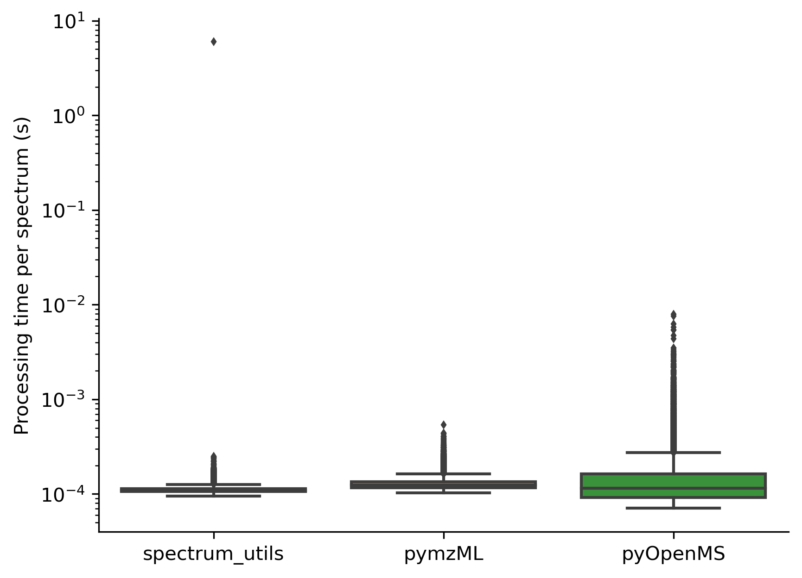

# Computational efficiency

Spectrum processing in spectrum_utils has been optimized for computational efficiency using [NumPy](https://www.numpy.org/) and [Numba](http://numba.pydata.org/) to be able to process thousands of spectra per second.

As shown below, spectrum_utils (version 0.3.0) is faster than alternative libraries, such as [pymzML](https://github.com/pymzml/pymzML/) (version 2.4.4) and [pyOpenMS](https://pyopenms.readthedocs.io/) (version 2.4.0), when performing typical spectrum processing tasks, including the following steps:

- The _m_/_z_ range is set to 100–1400 _m_/_z_.
- The precursor peak is removed.
- Low-intensity noise peaks are removed.
- Peak intensities are scaled by their square root.

```python
import time

import matplotlib.pyplot as plt
import numpy as np
import pyopenms
import pyteomics
import seaborn as sns
import spectrum_utils.spectrum as sus
from pymzml.spec import Spectrum


min_peaks = 10
min_mz, max_mz = 100, 1400
fragment_tol_mass, fragment_tol_mode = 0.02, "Da"
min_intensity = 0.05
max_num_peaks = 150


def time_spectrum_utils(mgf_filename):
    runtimes = []
    for spec_dict in pyteomics.mgf.read(mgf_filename):
        # Omit invalid spectra.
        if (
            len(spec_dict["m/z array"]) < min_peaks
            or "charge" not in spec_dict["params"]
        ):
            continue
        mz = spec_dict["m/z array"]
        intensity = spec_dict["intensity array"]
        retention_time = float(spec_dict["params"]["rtinseconds"])
        precursor_mz = spec_dict["params"]["pepmass"][0]
        precursor_charge = spec_dict["params"]["charge"][0]
        identifier = spec_dict["params"]["title"]

        spectrum = sus.MsmsSpectrum(
            identifier,
            precursor_mz,
            precursor_charge,
            mz,
            intensity,
            retention_time=retention_time,
        )

        start_time = time.time()

        spectrum.set_mz_range(min_mz, max_mz)
        spectrum.remove_precursor_peak(fragment_tol_mass, fragment_tol_mode)
        spectrum.filter_intensity(min_intensity, max_num_peaks)
        spectrum.scale_intensity(scaling="root", max_intensity=1)

        runtimes.append(time.time() - start_time)

    return runtimes


def time_pymzml(mgf_filename):
    runtimes = []
    for spec_dict in pyteomics.mgf.read(mgf_filename):
        # Omit invalid spectra.
        if (
            len(spec_dict["m/z array"]) < min_peaks
            or "charge" not in spec_dict["params"]
        ):
            continue

        spec = Spectrum()
        spec.set_peaks(
            [*zip(spec_dict["m/z array"], spec_dict["intensity array"])], "raw"
        )

        start_time = time.time()

        spec.reduce("raw", (min_mz, max_mz))
        spec.remove_precursor_peak()
        spec.remove_noise(noise_level=min_intensity)
        spec /= np.amax(spec.i)
        spec.i = np.sqrt(spec.i)

        runtimes.append(time.time() - start_time)

    return runtimes


def time_pyopenms(mgf_filename):
    experiment = pyopenms.MSExperiment()
    pyopenms.MascotGenericFile().load(mgf_filename, experiment)

    runtimes = []
    for spectrum in experiment:
        # Omit invalid spectra.
        if (
            len(spectrum.get_peaks()[0]) < min_peaks
            or spectrum.getPrecursors()[0].getCharge() == 0
        ):
            continue

        start_time = time.time()

        # Set the m/z range.
        filtered_mz, filtered_intensity = [], []
        for mz, intensity in zip(*spectrum.get_peaks()):
            if min_mz <= mz <= max_mz:
                filtered_mz.append(mz)
                filtered_intensity.append(intensity)
            spectrum.set_peaks((filtered_mz, filtered_intensity))
        # Remove the precursor peak.
        parent_peak_mower = pyopenms.ParentPeakMower()
        parent_peak_mower_params = parent_peak_mower.getDefaults()
        parent_peak_mower_params.setValue(
            b"window_size", fragment_tol_mass, b""
        )
        parent_peak_mower.setParameters(parent_peak_mower_params)
        parent_peak_mower.filterSpectrum(spectrum)
        # Filter by base peak intensity percentage.
        pyopenms.Normalizer().filterSpectrum(spectrum)
        threshold_mower = pyopenms.ThresholdMower()
        threshold_mower_params = threshold_mower.getDefaults()
        threshold_mower_params.setValue(b"threshold", min_intensity, b"")
        threshold_mower.setParameters(threshold_mower_params)
        threshold_mower.filterSpectrum(spectrum)
        # Restrict to the most intense peaks.
        n_largest = pyopenms.NLargest()
        n_largest_params = n_largest.getDefaults()
        n_largest_params.setValue(b"n", max_num_peaks, b"")
        n_largest.setParameters(n_largest_params)
        n_largest.filterSpectrum(spectrum)
        # Scale the peak intensities by their square root and normalize.
        pyopenms.SqrtMower().filterSpectrum(spectrum)
        pyopenms.Normalizer().filterSpectrum(spectrum)

        runtimes.append(time.time() - start_time)

    return runtimes


mgf_filename = "iPRG2012.mgf"
runtimes_spectrum_utils = time_spectrum_utils(mgf_filename)
runtimes_pyopenms = time_pyopenms(mgf_filename)
runtimes_pymzml = time_pymzml(mgf_filename)

fig, ax = plt.subplots()
sns.boxplot(
    data=[runtimes_spectrum_utils, runtimes_pymzml, runtimes_pyopenms],
    flierprops={"markersize": 2},
    ax=ax,
)
ax.set_yscale("log")
ax.xaxis.set_ticklabels(("spectrum_utils", "pymzML", "pyOpenMS"))
ax.set_ylabel("Processing time per spectrum (s)")
sns.despine()
plt.show()
plt.close()
```




## JIT compilation

Note that the significant outlier for spectrum_utils is caused by Numba's JIT compilation of the first method call, allowing subsequent calls to be made very efficiently.

If the user knows in advance that only a single method call needs to be made, Numba's JIT compilation can be disabled to avoid this overhead by setting the `NUMBA_DISABLE_JIT` environment variable to `1`.
See the [Numba documentation](https://numba.pydata.org/numba-doc/latest/user/troubleshoot.html#disabling-jit-compilation) for more information.
